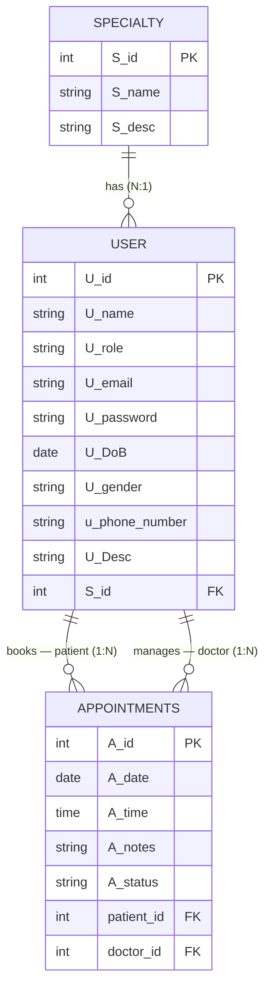

# useCare
medical project made by react and ~later will integrate django~ :)


## API

using mock data to fetch:
```js
{"_meta":{"today":"2026-05-18","description":"useCare mock DB. Paste into npoint.io to share with the team. Edit there to update the whole team's view at once.","schema_version":1},"users":[{"id":1,"name":"Sarah Admin","role":"admin","email":"admin@usecare.test","gender":"female","status":"approved","password":"admin123","description":null,"phone_number":"+20-100-000-0001","specialty_id":null,"date_of_birth":"1985-04-12"},{"id":2,"name":"Dr. Ahmed Tolba","role":"doctor","email":"ahmed@usecare.test","gender":"male","status":"approved","password":"doctor123","description":"8 yrs cardiology experience","phone_number":"+20-100-000-0002","specialty_id":1,"date_of_birth":"1986-09-03"},{"id":3,"name":"Dr. Samir Hassan","role":"doctor","email":"samir@usecare.test","gender":"male","status":"pending","password":"doctor123","description":"Pediatrician, fellowship at Cairo Univ.","phone_number":"+20-100-000-0003","specialty_id":2,"date_of_birth":"1990-01-22"},{"id":4,"name":"Dr. Mona El-Sayed","role":"doctor","email":"mona@usecare.test","gender":"female","status":"approved","password":"doctor123","description":"Dermatology specialist","phone_number":"+20-100-000-0004","specialty_id":3,"date_of_birth":"1988-07-15"},{"id":5,"name":"Dr. Karim Nasr","role":"doctor","email":"karim@usecare.test","gender":"male","status":"pending","password":"doctor123","description":"Neurology, stroke specialist","phone_number":"+20-100-000-0005","specialty_id":4,"date_of_birth":"1982-11-30"},{"id":6,"name":"Dr. Layla Farouk","role":"doctor","email":"layla@usecare.test","gender":"female","status":"approved","password":"doctor123","description":"Cardiologist, women's heart health focus","phone_number":"+20-100-000-0006","specialty_id":1,"date_of_birth":"1980-02-28"},{"id":7,"name":"Yara Mostafa","role":"patient","email":"yara@usecare.test","gender":"female","status":"approved","password":"patient123","description":null,"phone_number":"+20-100-000-0007","specialty_id":null,"date_of_birth":"1995-03-08"},{"id":8,"name":"Omar Hany","role":"patient","email":"omar@usecare.test","gender":"male","status":"approved","password":"patient123","description":null,"phone_number":"+20-100-000-0008","specialty_id":null,"date_of_birth":"1992-12-01"},{"id":9,"name":"Nour Adel","role":"patient","email":"nour@usecare.test","gender":"female","status":"approved","password":"patient123","description":null,"phone_number":"+20-100-000-0009","specialty_id":null,"date_of_birth":"2001-05-19"},{"id":10,"name":"Ali Mahmoud","role":"patient","email":"ali@usecare.test","gender":"male","status":"approved","password":"patient123","description":null,"phone_number":"+20-100-000-0010","specialty_id":null,"date_of_birth":"1978-08-25"},{"id":11,"name":"Hana Khaled","role":"patient","email":"hana@usecare.test","gender":"female","status":"approved","password":"patient123","description":null,"phone_number":"+20-100-000-0011","specialty_id":null,"date_of_birth":"1989-11-04"},{"id":12,"name":"Tarek Rashid","role":"patient","email":"tarek@usecare.test","gender":"male","status":"approved","password":"patient123","description":null,"phone_number":"+20-100-000-0012","specialty_id":null,"date_of_birth":"1975-06-17"}],"specialties":[{"id":1,"name":"Cardiology","description":"Heart and vascular system"},{"id":2,"name":"Pediatrics","description":"Care for infants and children"},{"id":3,"name":"Dermatology","description":"Skin, hair, nails"},{"id":4,"name":"Neurology","description":"Nervous system"}],"appointments":[{"id":1,"date":"2026-05-04","time":"09:00","notes":"Routine cardio check, all clear.","status":"completed","doctor_id":2,"patient_id":7},{"id":2,"date":"2026-05-06","time":"10:30","notes":"Prescribed mild statins.","status":"completed","doctor_id":2,"patient_id":10},{"id":3,"date":"2026-05-10","time":"14:00","notes":"Patient cancelled.","status":"cancelled","doctor_id":4,"patient_id":8},{"id":4,"date":"2026-05-12","time":"11:00","notes":"Eczema cream prescribed.","status":"completed","doctor_id":4,"patient_id":9},{"id":5,"date":"2026-05-15","time":"16:00","notes":"Follow-up in 6 weeks.","status":"completed","doctor_id":6,"patient_id":11},{"id":6,"date":"2026-05-18","time":"10:00","notes":"","status":"confirmed","doctor_id":2,"patient_id":7},{"id":7,"date":"2026-05-18","time":"15:30","notes":"","status":"confirmed","doctor_id":6,"patient_id":12},{"id":8,"date":"2026-05-19","time":"09:30","notes":"","status":"confirmed","doctor_id":4,"patient_id":8},{"id":9,"date":"2026-05-20","time":"11:00","notes":"","status":"pending","doctor_id":2,"patient_id":9},{"id":10,"date":"2026-05-21","time":"14:00","notes":"","status":"confirmed","doctor_id":6,"patient_id":10},{"id":11,"date":"2026-05-22","time":"16:30","notes":"","status":"confirmed","doctor_id":2,"patient_id":7},{"id":12,"date":"2026-05-23","time":"10:00","notes":"","status":"pending","doctor_id":4,"patient_id":11},{"id":13,"date":"2026-05-25","time":"09:00","notes":"","status":"pending","doctor_id":2,"patient_id":12},{"id":14,"date":"2026-05-26","time":"13:00","notes":"","status":"confirmed","doctor_id":6,"patient_id":8},{"id":15,"date":"2026-05-28","time":"15:00","notes":"","status":"pending","doctor_id":4,"patient_id":9},{"id":16,"date":"2026-05-29","time":"11:30","notes":"","status":"pending","doctor_id":6,"patient_id":7},{"id":17,"date":"2026-06-01","time":"10:00","notes":"","status":"pending","doctor_id":2,"patient_id":10}],"availabilities":[{"id":1,"date":"2026-05-18","end_time":"17:00","doctor_id":2,"start_time":"09:00","is_available":true},{"id":2,"date":"2026-05-20","end_time":"17:00","doctor_id":2,"start_time":"09:00","is_available":true},{"id":3,"date":"2026-05-22","end_time":"17:00","doctor_id":2,"start_time":"09:00","is_available":true},{"id":4,"date":"2026-05-25","end_time":"17:00","doctor_id":2,"start_time":"09:00","is_available":true},{"id":5,"date":"2026-05-27","end_time":"17:00","doctor_id":2,"start_time":"09:00","is_available":true},{"id":6,"date":"2026-05-29","end_time":"17:00","doctor_id":2,"start_time":"09:00","is_available":true},{"id":7,"date":"2026-05-19","end_time":"15:00","doctor_id":4,"start_time":"10:00","is_available":true},{"id":8,"date":"2026-05-21","end_time":"15:00","doctor_id":4,"start_time":"10:00","is_available":true},{"id":9,"date":"2026-05-26","end_time":"15:00","doctor_id":4,"start_time":"10:00","is_available":true},{"id":10,"date":"2026-05-28","end_time":"15:00","doctor_id":4,"start_time":"10:00","is_available":true},{"id":11,"date":"2026-05-18","end_time":"18:00","doctor_id":6,"start_time":"13:00","is_available":true},{"id":12,"date":"2026-05-20","end_time":"18:00","doctor_id":6,"start_time":"13:00","is_available":true},{"id":13,"date":"2026-05-22","end_time":"18:00","doctor_id":6,"start_time":"13:00","is_available":true},{"id":14,"date":"2026-05-25","end_time":"18:00","doctor_id":6,"start_time":"13:00","is_available":true}]}
```

## Docs

### Project [wire frame](https://raw.githubusercontent.com/DevAbdoTolba/useCare/refs/heads/main/docs/Untitled-2026-05-16-1800.svg)


### Projects [ERD](https://github.com/user-attachments/assets/6ca16691-4d6f-47dc-aea0-80fa9c6e42d3)




#### Relationships

| From | To | Verb | Cardinality |
|------|----|------|-------------|
| User | Specialty | Has | many users → one specialty (a doctor has one specialty) |
| User | Appointments | Book | one patient → many appointments |
| User | Appointments | Manage | one doctor → many appointments |


## Team Members

- [@Ahmed Fathi](https://github.com/AhmeedFatehy)
- [@Abdo Tolba](https://github.com/DevAbdoTolba)
- [@Ahmed Samir](https://github.com/AhmedSamirKhalaf)
