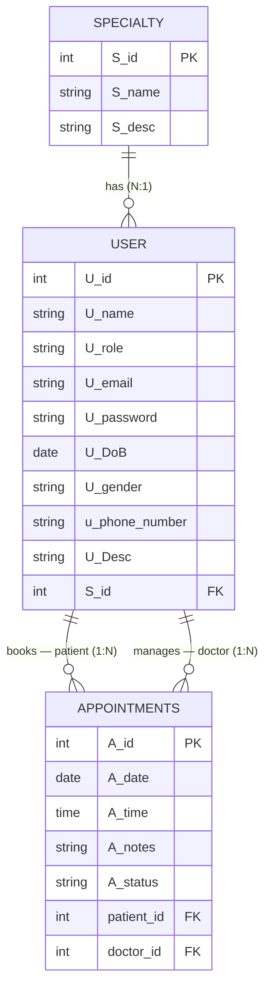

# useCare — ER Diagram (Mermaid)

Generated from [`docs/useCare.drawio`](./useCare.drawio). Field names are kept
as they appear in the diagram (`U_*`, `S_*`, `A_*`). Foreign keys shown are
implied by the relationship lines (Has / Book / Manage).

## Relationships

| From | To | Verb | Cardinality |
|------|----|------|-------------|
| User | Specialty | Has | many users → one specialty (a doctor has one specialty) |
| User | Appointments | Book | one patient → many appointments |
| User | Appointments | Manage | one doctor → many appointments |
