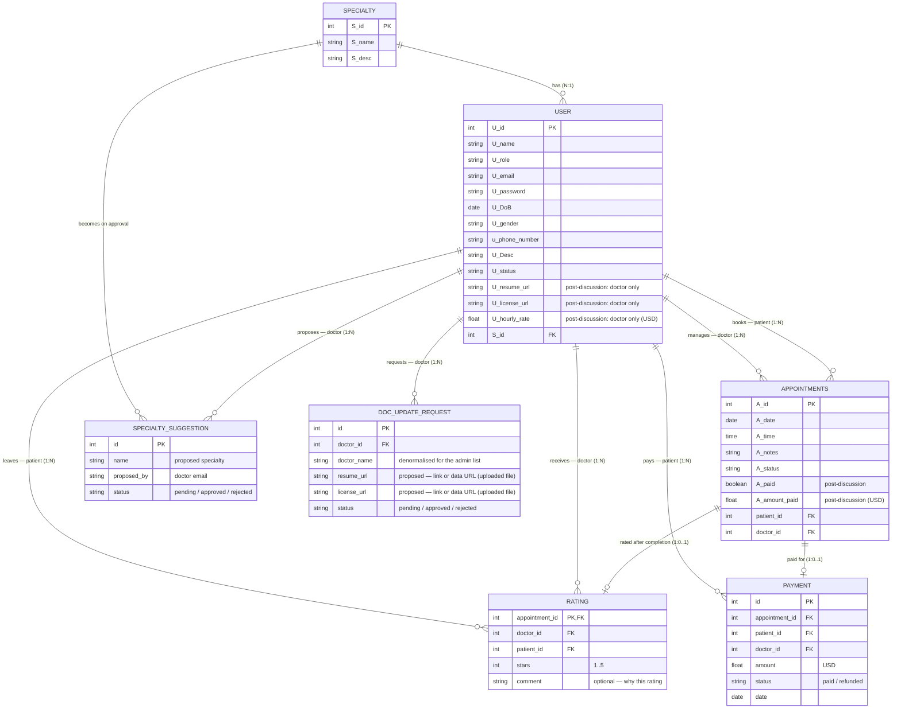

# useCare — ER Diagram (Mermaid)

Generated from [`docs/useCare.drawio`](./useCare.drawio). The three original
entities (User / Specialty / Appointments) keep the diagram's field names
(`U_*`, `S_*`, `A_*`).

Everything tagged **(post-discussion)** was added after the lecturer review:
verification docs + hourly rate on the doctor, plus the new Rating, Payment,
SpecialtySuggestion and DocUpdateRequest entities.

```mermaid
erDiagram
    SPECIALTY ||--o{ USER : "has (N:1)"
    USER ||--o{ APPOINTMENTS : "books — patient (1:N)"
    USER ||--o{ APPOINTMENTS : "manages — doctor (1:N)"

    APPOINTMENTS ||--o| RATING : "rated after completion (1:0..1)"
    USER ||--o{ RATING : "receives — doctor (1:N)"
    USER ||--o{ RATING : "leaves — patient (1:N)"

    APPOINTMENTS ||--o| PAYMENT : "paid for (1:0..1)"
    USER ||--o{ PAYMENT : "pays — patient (1:N)"

    USER ||--o{ SPECIALTY_SUGGESTION : "proposes — doctor (1:N)"
    SPECIALTY_SUGGESTION }o--|| SPECIALTY : "becomes on approval"

    USER ||--o{ DOC_UPDATE_REQUEST : "requests — doctor (1:N)"

    USER {
        int U_id PK
        string U_name
        string U_role
        string U_email
        string U_password
        date U_DoB
        string U_gender
        string u_phone_number
        string U_Desc
        string U_status
        string U_resume_url "post-discussion: doctor only"
        string U_license_url "post-discussion: doctor only"
        float U_hourly_rate "post-discussion: doctor only (USD)"
        int S_id FK
    }

    SPECIALTY {
        int S_id PK
        string S_name
        string S_desc
    }

    APPOINTMENTS {
        int A_id PK
        date A_date
        time A_time
        string A_notes
        string A_status
        boolean A_paid "post-discussion"
        float A_amount_paid "post-discussion (USD)"
        int patient_id FK
        int doctor_id FK
    }

    RATING {
        int appointment_id PK,FK
        int doctor_id FK
        int patient_id FK
        int stars "1..5"
        string comment "optional — why this rating"
    }

    PAYMENT {
        int id PK
        int appointment_id FK
        int patient_id FK
        int doctor_id FK
        float amount "USD"
        string status "paid / refunded"
        date date
    }

    SPECIALTY_SUGGESTION {
        int id PK
        string name "proposed specialty"
        string proposed_by "doctor email"
        string status "pending / approved / rejected"
    }

    DOC_UPDATE_REQUEST {
        int id PK
        int doctor_id FK
        string doctor_name "denormalised for the admin list"
        string resume_url "proposed — link or data URL (uploaded file)"
        string license_url "proposed — link or data URL (uploaded file)"
        string status "pending / approved / rejected"
    }
```

## Relationships

| From | To | Verb | Cardinality |
|------|----|------|-------------|
| User | Specialty | Has | many users → one specialty (a doctor has one specialty) |
| User | Appointments | Book | one patient → many appointments |
| User | Appointments | Manage | one doctor → many appointments |
| Appointments | Rating | Rated | each completed appointment → at most one rating *(post-discussion)* |
| User | Rating | Receives / Leaves | a doctor gets many ratings; a patient leaves many *(post-discussion)* |
| Appointments | Payment | Paid for | each appointment → at most one payment *(post-discussion)* |
| User | Payment | Pays | one patient → many payments; platform keeps a 12% cut *(post-discussion)* |
| User | SpecialtySuggestion | Proposes | a doctor proposes specialties the admin approves into Specialty *(post-discussion)* |
| User | DocUpdateRequest | Requests | a doctor files résumé/license changes the admin approves back onto User *(post-discussion)* |

## Notes on the additions

- **U_resume_url / U_license_url** — required at doctor signup; the admin opens
  both before approving or rejecting the account. Each field stores either a
  link (`https://…`) or a `data:` URL when the doctor uploaded a file directly.
- **U_hourly_rate** — the consultation fee shown to patients and charged through
  the PayPal sandbox at booking time.
- **Payment** — `amount_paid` on the appointment is the per-booking record;
  `Payment` rows are the ledger the admin dashboard sums (total paid + 12%
  platform revenue).
- **SpecialtySuggestion** — a doctor whose specialty isn't listed proposes one;
  approving it creates a real `Specialty`.
- **DocUpdateRequest** — already-approved doctors can't silently swap their
  résumé/license. They file a `DocUpdateRequest`; admin approval patches the
  matching `U_resume_url` / `U_license_url` back onto `User`.
